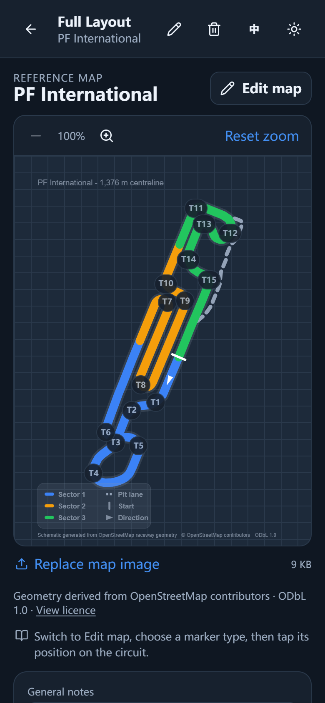
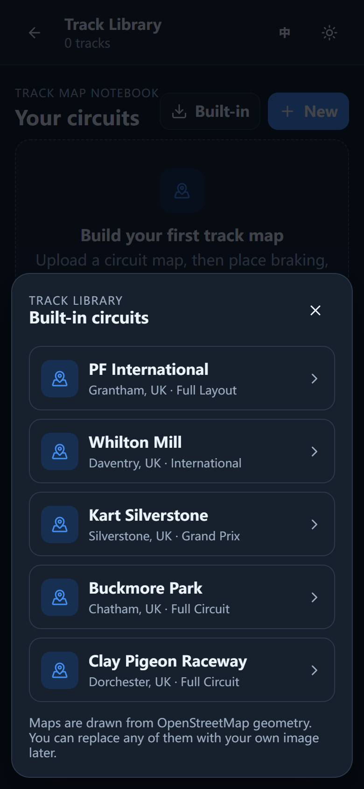

# karting-tools-notes

Design documentation and UI screenshots for **Kart Data**, a local-first, mobile-first
trackside recorder for karting, and its **Track Map Notebook** feature module.

*[中文说明](README.zh-CN.md)*

> **This repository contains no application code.**
> The application is
> [karting-data-recording-website](https://github.com/AlexLiaoooo/karting-data-recording-website),
> which deploys from `main` to <https://karting-data-recording-website.vercel.app>.
> The Track Map Notebook module lives there under `components/track-map/`.

This repo exists so the design work and reference screenshots are backed up and
reviewable in one place, independently of the app repository and of local machines.

<p align="center">
  
  &nbsp;&nbsp;
  
</p>
<p align="center"><em>The PF International reference map, and the built-in circuit picker. Captured 2026-09-10; the full set is listed below.</em></p>

## Contents

### `docs/` — design notes

| File | What it covers |
| --- | --- |
| [Track Map Notebook - Architecture.md](docs/Track%20Map%20Notebook%20-%20Architecture.md) | **Historical record, superseded 2026-09-09** — see Status below. The design as confirmed on 2026-08-15 for Track Map Notebook: product model (Track → Layout → markers → visits), data model and TypeScript types, IndexedDB store layout and migration rules, marker types, image handling, backup/restore, MVP scope and later phases. |
| [Karting Tools - Idea Backlog.md](docs/Karting%20Tools%20-%20Idea%20Backlog.md) | The other twelve karting tool ideas that were considered, with value/difficulty notes, plus ideas explicitly ruled out and a suggested build order. |

These are mirrored from an Obsidian vault, which remains the source of truth.
See [Keeping the docs in sync](#keeping-the-docs-in-sync).

**Why these live here and not in the application repository.** The architecture note
describes a feature module inside Kart Data, so it could reasonably sit beside that code.
The idea backlog could not: it spans twelve separate tool concepts, most of which are not
Kart Data, plus adjacent non-karting tools. That is portfolio-level planning, not
application documentation. The two notes are also a linked pair, and separating them would
break the wikilinks in both directions. Both therefore stay here, and this repository is
the design and planning archive for the karting tools generally rather than for Kart Data
alone.

### Screenshots

Filed by capture date rather than overwritten. An image carries no date of its own, and an
old screenshot of a changed interface is indistinguishable from a current one.

#### `screenshots/2026-09/` — current

Captured 2026-09-10 from the live site at a 390x844 mobile viewport, dark theme.

| File | What it shows |
| --- | --- |
| [`home-dark-mobile.png`](screenshots/2026-09/home-dark-mobile.png) | Home screen, empty state, with the language toggle and the Track Library shortcut. |
| [`create-event-modal-mobile.png`](screenshots/2026-09/create-event-modal-mobile.png) | Create event, including the saved Track Layout selector and the Open-Meteo temperature lookup. |
| [`built-in-circuits-mobile.png`](screenshots/2026-09/built-in-circuits-mobile.png) | The built-in circuit picker: PF International, Whilton Mill, Kart Silverstone, Buckmore Park and Clay Pigeon Raceway. |
| [`pfi-map-mobile.png`](screenshots/2026-09/pfi-map-mobile.png) | PF International reference map with T1-T15 corner labels, sector legend, start line, direction arrow and centreline length. |
| [`map-edit-mode-mobile.png`](screenshots/2026-09/map-edit-mode-mobile.png) | Edit map mode with the marker type picker, kept separate from viewing so a marker cannot be moved by accident. |
| [`interface-chinese-mobile.png`](screenshots/2026-09/interface-chinese-mobile.png) | The Simplified Chinese interface. Event, Session, Run and Track Library stay in English, as `DESIGN.md` requires, with Chinese prose around them. |

#### `screenshots/2026-08/` — historical

Captured 14-15 August 2026, when the MVP shipped. **These are a record, not documentation of
the current app.** Between the two sets the app gained four more circuits, corner numbering,
a Simplified Chinese interface and a rebuilt PF International map.

| File | What it shows |
| --- | --- |
| [`pfi-default-map.png`](screenshots/2026-08/pfi-default-map.png) | The PF International map as first generated. It was rebuilt on 2026-08-31 after being drawn 1.65x too wide, so this shows geometry the app no longer produces. |
| [`track-map-session-mobile.png`](screenshots/2026-08/track-map-session-mobile.png) | Session track notes, with the permanent reference shown read-only above a session observation and a Better/Same/Worse result. The marker is typed `CORNER`, a type that no longer exists. The map area is a placeholder, as this predates the schematic. |
| [`theme-dark-mobile.png`](screenshots/2026-08/theme-dark-mobile.png) | Home screen, dark, empty state, before the language toggle and Track Library shortcut were added. |
| [`theme-dark-modal-mobile.png`](screenshots/2026-08/theme-dark-modal-mobile.png) | Create event modal, dark theme. |
| [`theme-light-modal-mobile.png`](screenshots/2026-08/theme-light-modal-mobile.png) | Create event modal, light theme. |
| [`ambient-temperature-mobile.png`](screenshots/2026-08/ambient-temperature-mobile.png) | Create event with ambient temperature filled from device location via Open-Meteo. |

## Status

The Track Map Notebook MVP shipped on 2026-08-15 and the module has been developed
since. As of the 2026-08-31 code it has five built-in circuits (PF International,
Whilton Mill International, Kart Silverstone Grand Prix, Buckmore Park and Clay Pigeon
Raceway), corner numbering derived from the map geometry, a marker taxonomy of corner
phases and pedal inputs, a full Simplified Chinese interface, zoom and pan including
pinch, session overlays, offline persistence, and backup/restore with map images.

Next Run focus was dropped rather than deferred: `TrackVisit` carries no `focusMarkerIds`
and `MarkerObservation` has neither `runId` nor `promoteToReference`. Run-specific
observations, racing lines, GPS and telemetry overlays remain unbuilt.

> **The architecture note here is a historical record, not current documentation.** It
> describes the design as confirmed on 2026-08-15 and the implementation has since moved
> on, most visibly in the marker types, which were replaced outright. The living design
> document is
> [`DESIGN.md`](https://github.com/AlexLiaoooo/karting-data-recording-website/blob/main/DESIGN.md)
> in the application repository, which carries its own change log. Where the two disagree,
> that document is correct. The note is kept for the reasoning behind the original
> decisions, and its storage design is still accurate.

## Keeping the docs in sync

The Obsidian vault is the source of truth. The copies in `docs/` are byte-identical
mirrors, and `.gitattributes` pins `*.md` to LF so `core.autocrlf` cannot rewrite them
to CRLF on checkout and break that.

After editing the notes in Obsidian, copy them across before committing:

```powershell
.\scripts\sync-docs.ps1
```

To check whether `docs/` has gone stale without changing anything (exits `1` if it has,
so it works as a pre-commit check):

```powershell
.\scripts\sync-docs.ps1 -Check
```

The script only ever copies vault → repo, never the reverse, and never commits. If the
vault moves, pass the new location with `-VaultPath '<folder>'`.

Exit codes: `0` up to date, `1` stale, `2` vault not found.

### Enforcing it

A tracked pre-commit hook in [`.githooks/pre-commit`](.githooks/pre-commit) runs that
check and refuses the commit while `docs/` is behind the vault, so the mirror cannot
drift by being forgotten. Enable it once per clone:

```powershell
git config core.hooksPath .githooks
```

The hook only blocks on exit code `1`. If the check cannot run at all — no vault on this
machine, no PowerShell, script missing — it is skipped with a warning and the commit
proceeds, because a check that is merely unavailable should never wedge the repository.
To bypass it deliberately:

```powershell
git commit --no-verify
```

Because the notes are mirrored verbatim, Obsidian wikilinks such as
`[[Karting Tools - Idea Backlog]]` render as literal text on GitHub rather than as links.
That is deliberate: it keeps the two copies identical and the sync a plain file copy.

## Licence

© 2026 Alex Liao. Everything in this repository — the design notes, the screenshots and the two
helper scripts — is released under
[Creative Commons Attribution 4.0 International](LICENSE) (CC BY 4.0). Reuse it however you
like, with credit.

The PF International screenshots show a map whose geometry is derived from OpenStreetMap,
which is © OpenStreetMap contributors under the
[Open Database License 1.0](https://opendatacommons.org/licenses/odbl/1-0/). That attribution
is carried in the images themselves.
